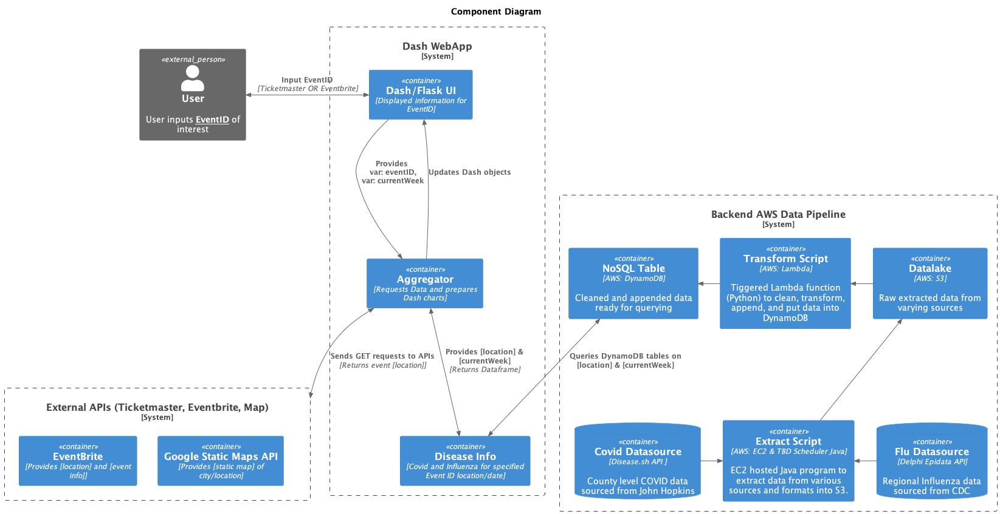
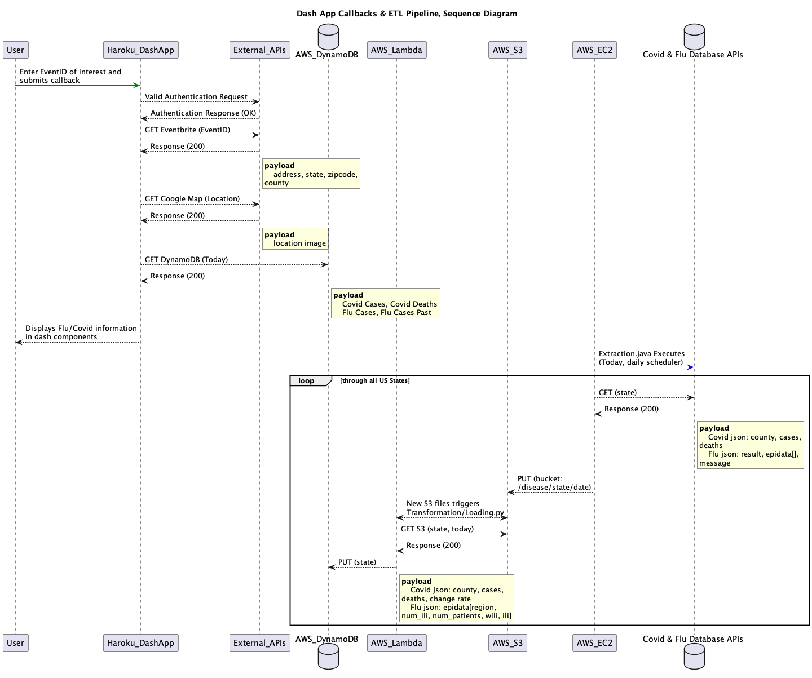

# Event Safety Levels

## About The Project

This project was created for general programming practice. See Technology Stack for more details.

The overall application use case is for an event attendee who wishes to gauge the relative safety of an event venue due to Covid and Influenza.
This application has two components to it: 1) a user facing Dash Webapp and 2) a backend ETL pipeline.

The webapp allows a user to enter an EventBriteID OR a State/County into the dashboard then an overall summary of the event, event location, and relavent Covid/Influenza data will be displayed. The ETL pipeline runs on a scheduler to update a set of database tables with relavent Covid and Influenza data. Data sources are:
 * Covid API https://disease.sh/docs/#/COVID-19%3A%20JHUCSSE/get_v3_covid_19_historical_usacounties__state_
 * Flu API https://cmu-delphi.github.io/delphi-epidata/api/fluview.html

### Architecture
The overall architecture is described in these two diagrams below. The Dash application is hosted on Heroku. The ETL pipeline and databases are hosted across AWS services. AWS was chosen over Google GCP as GCP was used in a previous project.

Component Diagram:


Sequence Diagram:


## Technology Stack

* Orchestration: AWS EventBridge Scheduler
* Datalake: AWS S3
* Data Warehouse: AWS DynamoDB
* Batch Processing / Transformations: Java, Python, Pandas, AWS EC2, AWS Lambda
* Front End: Dash/Flask
* Testing: PyTest
* External APIs: EventBrite, Google Static Map

## Files
```
├── README.md
├── assets
│   └── set of reference files used by the application (i.e. list of states, table schema, etc...)
├── dashApp
│   ├── api.py Set of functions to interface with EventBrite and Google Map APIs
│   ├── app.py Main Dash App
│   └── awsdb.py Set of helper functions to access AWS DynamoDB
├── extractTo
│   ├── src
│      ├── main/java/com/sunshine/extractToS3.java Extraction script to pull from Covid and Influenza open data sources
│   ├── target
│      ├── target/classes/com/sunshine/extractToS3.java Associated Java class files
│   └── pom.xml Maven configuration file
├── keys
│   ├── (placeholder_apikey).json
│   ├── (placeholder_aws_config)
│   └── (placeholder_aws_credentials)
├── loadTo
│   └── loadToDynamo.py Transformation/Loading script to clean and put/update relavent data into DynamoDB
└── tests
    ├── conftest.py Pytest configuration file
    └── tests.py Pytest test cases
```

### Local or Cloud Deployment

TBD instructions on setup